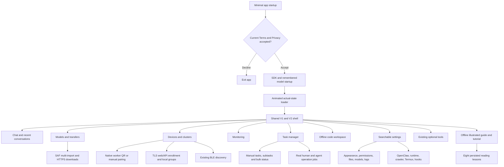
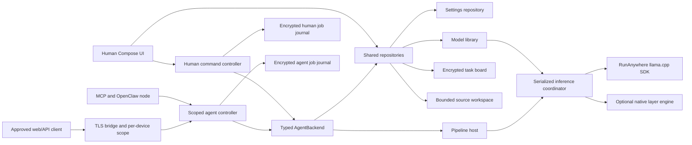
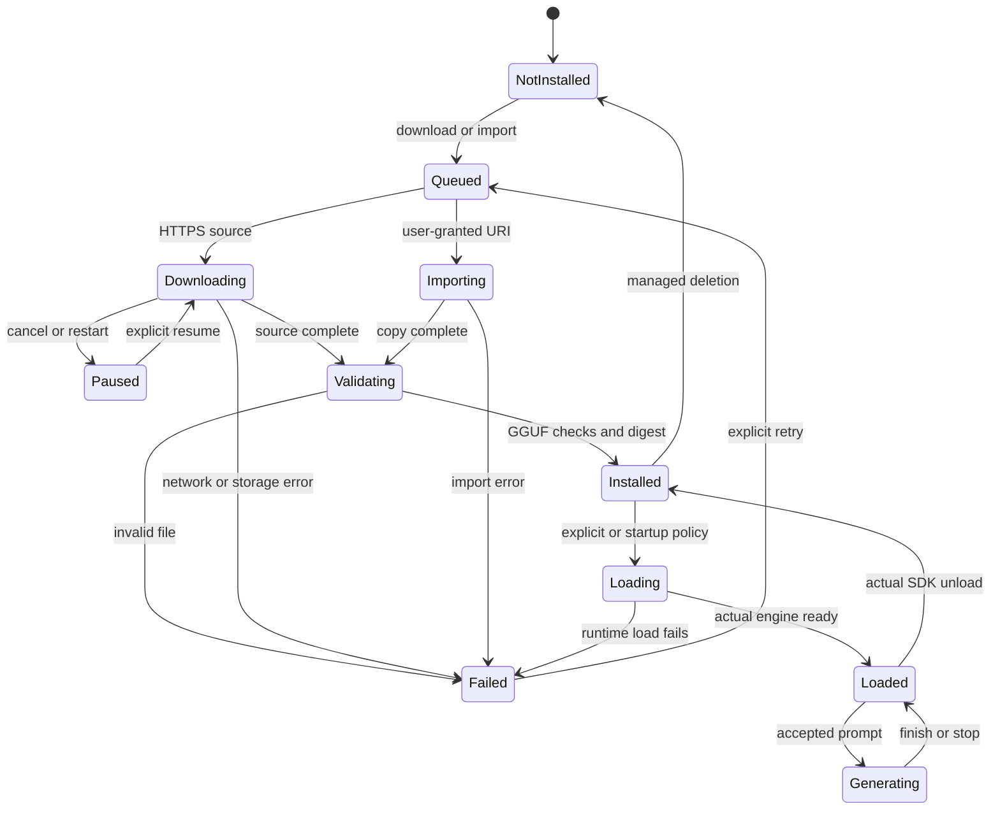
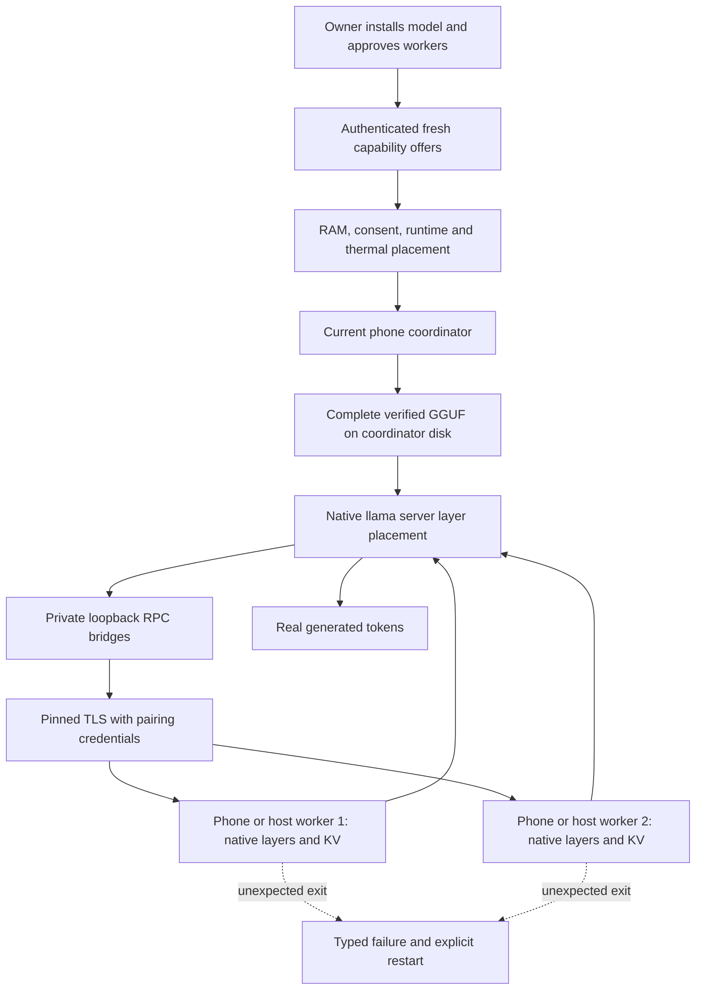
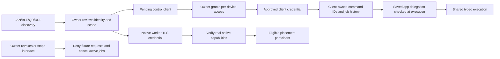
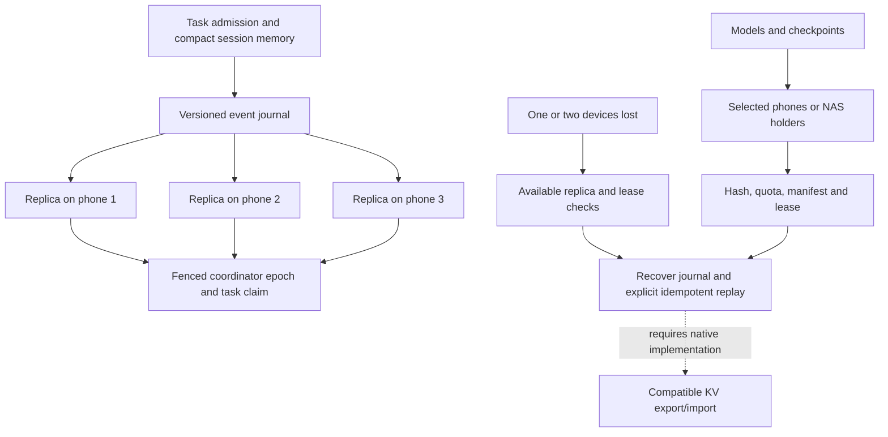

# Meshlit structured feature and architecture map

Updated 2026-10-08. This is the map of the separate Codex implementation, not the
old Android checkout. `PROGRESS.md` records evidence; `PLAN.md` records unfinished
acceptance. Machine-readable companion: `docs/feature-map.json`.

**Status vocabulary:** Implemented = source wired; Tested = named automated check;
Host proof = real desktop runtime evidence; Phone proof = physical Android evidence;
Planned = a requirement still needing implementation. Never treat those as synonyms.

## 1. Product navigation

Drawer and Settings expose Tasks and the workspace. Devices separates native layer
workers, forwarding peers and control clients. Legacy Tools preserves working
features during migration. A unified fully redesigned version of every legacy
tool page is still future work; the modern shell does not make old stubs functional.

## 2. Backend ownership

Manual task status and operation execution status are independent. Tasks may link
a job ID, but marking Done does not synthesize a successful native/agent result.
Queues admit durably before execution, retain 100 jobs each, permit two concurrent
operations with eight queued/running admissions, and expose explicit cancellation.
Interrupted jobs require live-state inspection and a new ID for retry.

## 3. Model lifecycle

Remote artifact integrity, local library state and native runtime state have
separate owners. Known hashes are verified; arbitrary GGUF imports obtain a
content hash. Header validation cannot establish a model's architecture compatibility
or quality. On boot, an installed remembered model loads only when enabled and
memory/session checks permit it. Missing files never trigger a silent download.

## 4. Task manager and operation map

| Function | Owner | State / result |
|---|---|---|
| Create task/subtask | TaskBoard | durable UUID record, parent validated |
| Edit title/notes/tags/priority/due | TaskBoard | revision precondition prevents stale overwrite |
| Search/filter/sort | TaskManagerScreen | local records; status, priority, updated/due ordering |
| Select/bulk Done/Cancel/Reopen | TaskBoard | atomic status update of selected known records |
| Delete | TaskBoard | revision required; children must be removed first |
| Link operation | ManagedTask.linkedJobId | reference to real retained job, no fake synchronization |
| Start model/cluster operation | humanController | QUEUED → RUNNING → terminal result |
| Track agent work | controller | same typed job contract; separate encrypted history |
| Stop selected operations | respective controller | cancellation; no rollback of completed side effects |
| Retry | controller.retry | new request ID, source retained, live state inspection needed |
| Agent task operations | AgentBackend | TASKS delegation; schema-discoverable commands |
| Remote tasks | web bridge | per-device TASKS access plus saved agent delegation |

Manual board limit: 200 records. Task notes ≤6000 characters, ten tags, four priority
levels. Job history eviction means a linked job may no longer be available.
Scheduled unattended task execution, recurring automation, dependencies, assignee
leases and durable distributed task replication are planned additions, not shipped
behaviors of the manual board.

## 5. Phone-first native pipeline

Implemented native layer offload is distinct from tensor parallelism, MoE routing
and forwarding independent jobs. Host proof used two actual worker processes and
matched deterministic baseline output. Physical phones, an oversized model and
heterogeneous performance are not yet proven. Current activation stays on the
local model owner; capability-based election planning is not distributed consensus.
QR scanning verifies a credential/fingerprint before explicit approval, not a
hardware attestation. Native runtime binaries are optional per-ABI build outputs.

## 6. Enrollment and authority

Web/API listeners remain off by default. Port 18792 is TLS, browser enrollment
uses a 15-minute invitation and owner approval, scopes are independent of claimed
roles, and raw client tokens are not stored in the directory. Tokens stay in the
browser's memory unless the user explicitly copies one. The phone's self-signed
certificate fingerprint must be checked before accepting it. No root/OS permission
or peer trust can be enlarged by an agent command.

Browser/API control membership does not automatically authorize native compute.
Local groups contain approved control identities and are labels/selections; current
native worker membership is managed separately. BLE discovery and Android bonding
alone do not establish the native TLS layer transport.

## 7. Required durable hive design — planned

The running implementation has encrypted local tasks and job journals. The diagram
above is the required distributed milestone, not current failover evidence. A task
list on one phone does not satisfy replication. Two crashes are recoverable only
if replica placement/quorum and heavy-file availability survive those failures.
Portable KV requires real native state APIs plus model/runtime/context compatibility.
No Kubernetes/Docker feature is implied by visual similarity or local metadata.

## 8. Full feature inventory

| Area | Implemented or retained | Remaining acceptance / work |
|---|---|---|
| Local text engine | RunAnywhere SDK, content registration, request options, unload | physical-device load/generate/stop/reboot; bundled emulator generation passes; stream-event token accounting still needs correction |
| Model library | verified/resumable HTTPS, bounded multiple downloads, multi-SAF import, load/delete, startup selection | phone source/provider/low-memory/lifecycle tests; richer HF/mirror picker |
| Chat | shared modern screen, history, streaming, Stop, selection/code Copy | full Share/Export parity and responsive device inspection |
| Settings | real route registry, Basic/Advanced, search, dynamic colors, font, logs, permissions, existing files/Termux/hooks | leaf-level index expansion; complete legacy-screen modernization |
| Permissions | optional first launch and contextual notification request | OS denial/permanent-denial/device checks; no automatic grant |
| Task manager | local durable board and real human/agent operations | device UX, recurrence/dependencies, distributed claims |
| Code workspace | offline CodeMirror, languages, search, bounded files and optimistic SHA writes | compile/run/debug toolchains, projects and unsaved-buffer recovery |
| Native clusters | TLS-approved workers, QR/manual pairing, fresh offers, memory plan, native layer runtime | physical-phone and oversized-model proof, remote owner activation |
| Role planning | stable candidate selection and budget weights | replicated election/fencing/heartbeats; hardware benchmark evidence |
| Mixed devices | categories/control enrollment/local groups; Python native worker companion | actual compute/storage/tool adapters for each capability |
| Web/API | TLS browser enrollment, owner scopes, own jobs, revoke, typed commands | phone TLS/browser interoperability and physical LAN tests |
| BLE/LAN/forwarding | existing scanning and separate router surfaces | unified fast device list, stale eviction and transport checks |
| SSH | actual pinned-host JSch exec, encrypted credentials and cancellation | live server validation; worker deployment, PTY and SFTP UI |
| Task memory | encrypted local manual board and human/agent journal | compact durable replicas on every phone |
| Heavy files | local managed GGUF and optional runtime artifact store | selected remote storage holders, manifests, quotas and leases |
| Recovery | interrupted jobs and explicit new-ID retry; typed native failure | remote crash replay, portable KV, coordinator failover |
| Monitor | real RAM/storage/battery/thermal/inference state | measured cluster rate/network allocation charts and device testing |
| Network tools | diagnostics and retained VPN/PCAP/PCAPdroid/Termux | authoritative capture state and HTTP observer UI fixes |
| Linux sandbox | bounded commands, optional rootless QEMU/SSH adapters | physical runtime/VM process lifecycle and resource proof |
| Root/desktop | human-only root boundary, optional VM/desktop configuration | actual installed root/VNC toolchain acceptance |
| Browser agent | bounded visible WebView sessions plus reviewed steps from local inference | physical-phone and real-model real-site task proof |
| Crawler | optional Crawl4AI companion and scoped MCP bridge | live browser smoke/setup; blocked sites remain blocked |
| OpenClaw | encrypted gateway profile, signed Android node adapter, text phone provider | real gateway pairing/commands; full operator/function-calling parity |
| Android autonomy | saved delegation, allowlist, emergency stop, AccessibilityService actions | normal APK/physical-device protected/password and revocation checks |
| Multi-OS | portable contracts and host companion boundary | Linux/Windows/macOS/HarmonyOS applications/adapters |
| Vendor acceleration | optional source build switches and reserved backend interfaces | installed/probed CUDA/HIP/SYCL/Metal/Vulkan/OpenCL/MUSA/CANN validation |
| Chinese devices | HarmonyOS/Huawei/Hygon and optional MUSA/CANN planning | real hardware integration, non-GMS scanner fallback UX |
| Guide/tutorial | 19 offline illustrated chapters and eight reading lessons | interactive execution walkthroughs and physical-device UX |
| Tracking/agent guide | AGENTS/CLAUDE/AGENT_BUILD, build/plan/progress, old-project audit | update evidence after every changed acceptance case |

## 9. Source map and validation

Core portable contracts: `core-mcp/control`, `core-inference/models` and `pipeline`.
Android adapters/DI: `app/control`, `models`, `pipeline`, `openclaw`, `permissions`.
Compose surfaces: `app/ui/modern`; original feature tools remain in `ui/screens`.
Host companions: `companions/crawler`, `companions/pipeline`, editor build source.
Native build and proof: `scripts/build-pipeline-native.py`, `prove-layer-rpc.py`.

Run `python3 scripts/validate-feature-map.py` to check the machine-readable map's
referenced paths and that the public operation inventory still matches source.
`BUILD.md` supplies build commands; `PROGRESS.md` records results/limitations.
A successful map validator is documentation consistency, not runtime validation.

## Device-aware model runtime additions

Models now includes the real pinned 135M bundled asset, RunAnywhere/HTTPS transfer
selection, per-artifact quantization variants, GGUF metadata, optional native local
context/KV settings, observed device planning and a Hugging Face Hub/hosted panel.
Read `docs/device-aware-model-runtime.md` and `docs/hugging-face-integration.md`.
The operation inventory now includes `MODEL_OPTIONS_SET` and `DEVICE_RUNTIME_STATUS`
(38 operations total). SDK-managed context is explicitly unknown; it is not reported
as an applied native capacity. Public/live data, estimates and pending device
validation remain separate. Shared KV/task replication remains planned.

## Online, power, hardware and deployment additions (2026-10-06)

The structured inventory now has 55 feature areas and 38 durable command operations.
Additional MCP environment/SSH tools are separate from that operation count.

| Settings route | Actual source behavior | Evidence / limits |
| --- | --- | --- |
| Online providers | Encrypted keys/templates, API model discovery, real cloud calls, offline/online chat, live HF pricing/free filter | Paid APIs need owner credentials; buffered replies; other prices are reviewed through official pages |
| Power & Costs | Actual battery/thermal/network readings, estimates/export, transfer/load policies | Whole-device battery estimate; no app-only/wall-plug/USB power claim |
| External devices / OTG | Actual USB classes/IDs/permissions, mounted volumes and SAF grants | Physical driver/hotplug tests pending; no USB GPU inference adapter |
| Acceleration | New-model SDK/native defaults and native CPU thread cap | Vendor GPU/NPU/platform plugins remain planned |
| SSH | JSch 2.28.7, host-key pin, encrypted credentials, bounded exec/cancel | Server required; no automatic deployment, SFTP UI or PTY |
| Network rules | Persisted default/port rules applied to legacy/control/RPC listeners | IPv4 private address gate; not OS-wide or outbound firewall |
| Agents | Real tool inventory, typed jobs and scope management | Cloud/SSH also need per-profile/host opt-in |
| Configuration profiles | Strict v1 export/import, preview and local preflight | No secrets/trust/delegation; multi-store apply reports partial failures |

Read [implementation details](docs/online-power-peripherals-and-configuration.md)
and [declarative federation plan](docs/declarative-federation-roadmap.md).
Future compact-memory replication, cross-cluster task leases, WAN brokers and IaC
providers are planned explicitly and must not be exposed as completed services.

## Non-LLM node and media directions

Enrollment accepts Raspberry Pi, microcontroller, sensor and radio categories;
requested roles include media, sensors, actuation and preprocessing. Approval
does not grant capabilities. Main Settings exposes real bounded image/camera
input and existing voice paths; current VLM backend availability is separate.
Authorized CCTV, UVC streams, MCU telemetry/actions, radio/DSP gateways and
internet task federation remain planned with explicit gates in
[media/IoT/radio plan](docs/media-iot-and-radio-nodes.md).

## Scenario model routing and media

Settings → Model router and chat options support explicit scenario rules,
one-model routes, sequential chains and labeled answer comparisons. Preflight
rejects unavailable or undelegated participants; no automatic provider fallback.
Chat attaches bounded real UTF-8 file content, and its media entry opens real
image upload/online vision, image generation, speech and async-video adapters.
API access/output success requires real provider testing; generic sound/music
and on-device diffusion/video remain unavailable. Read
[router/media contracts](docs/model-router-and-media.md).

## Custom models and training continuation (2026-10-06)

Read [docs/local-model-behavior-and-training.md](docs/local-model-behavior-and-training.md). Custom local prompt behavior is default-off;
compatible custom weights are imported through Models. No toggle changes learned
refusals or hosted-provider rules. Settings → Fine-tuning drives the optional
Soup 0.75.0 POSIX host companion via pinned SSH, with real job/status/log/cancel
contracts. Android synthetic gradients are removed; phone autograd reports
unavailable. Actual Soup training, adapter quality/evaluation and GGUF deployment
remain acceptance gates. Keep phone inference layer sharding/recovery primary.

## Native checkpoints and accounting continuation

Settings → Checkpoints and recovery saves/restores actual native CPU prompt-cache
slots, encrypted by Keystore AES-GCM with SHA/model/executable/context/precision
checks and bounded retention. Read `docs/native-checkpoints.md`. This is a local
recovery primitive; distributed task/session replication and portable/RPC KV
restoration remain unimplemented. Streamed text deltas no longer establish token
counts. Runtime usage may be unknown; the UI and wire payload preserve that state.

## Cloud and credentials

Dedicated Cloud/settings entry: source-backed AWS/Azure/DigitalOcean/GCP/OpenRouter
identity/resource/billing reads and custom read-only HTTPS functions; dashboard
values retain response/source/time. Encrypted environment vault, API/online,
pinned SSH and human-approved browser login consumers; independent human/agent
permissions, expiry, request quotas and cooldowns. CLOUD_PROFILES,
ENVIRONMENT_PROFILES and CLOUD_EXECUTE bring the inventory to 38 operations.
Authenticated vendor accounts, OAuth, deployment and broader service coverage
remain explicit acceptance/implementation gates. See `docs/cloud-and-credential-management.md`.

## Browser, guide, appearance and archives continuation

`BROWSER_STATUS`, `BROWSER_AUTONOMOUS_RUN` and `BROWSER_STOP` use the visible
Android WebView through `BrowserSessionBroker`. Sessions have an approved HTTPS
origin, separate saved human/agent/site permissions, 1–20 actions, a 120-second
deadline, revocation checks and Stop. Global/enrolled-device BROWSER permission
is separate from each site policy. Autonomous links use same-origin navigation;
arbitrary action buttons, login and submissions require human review. Installed
Chrome/Samsung Internet can use the existing explicitly delegated Accessibility
tools, with a detected-browser scope selector. This is separate from the DOM
loop and needs physical validation. Real model/site task acceptance remains a gate.

Appearance persists Figtree/system/serif/mono fonts and solid/tinted-glass
surfaces; constrained devices/high contrast fall back to solid. Guide/tutorial
has 20 offline chapters, three conceptual SVG diagrams and eight reading lessons.
Files keeps granted-storage browsing, adds bounded AI text inspection and streaming
ZIP/unzip with limits, cancellation, CRC checks, unsafe-path/collision rejection
and cleanup. Large provider-backed storage acceptance remains separate.

## Audit telemetry

Settings → Audit and telemetry wires encrypted retained metadata, filters, JSONL/CSV
export and optional OTLP/HTTP traces/metrics. Device measurements and typed human/
agent command outcomes are real observations; source coverage/retention/drop limits
and collector setup are in [docs/AUDIT_TELEMETRY.md](docs/AUDIT_TELEMETRY.md).

## Distribution, agreements and new roadmap areas

The structured map now contains 61 areas, including explicitly planned AI-assisted
repair, signed update channels and hardware/security lab profiles. These are not
implemented by the existing retry/resume or runtime shell controls. Two distribution
channels are GitHub Full and the future Google Play edition. The present Play Review
APK/AAB is a restricted candidate with remaining submission gates. Both include
versioned first-use policies, an actual-state animated boot loader and compact Models/
Monitor hero cards. Read docs/PLAY_DISTRIBUTION.md, docs/AI_REPAIR_AND_EVOLUTION.md
and docs/SECURITY_LAB_AND_HARDWARE_ACCESS.md.

## Gateway and VM Security Lab continuation (2026-10-07)

The inventory now has 65 feature areas; durable AgentOperation DTOs remain at 38.
New Settings routes expose built-in MCP/A2A/buffered model gateway, manual commands
and model instructions, VM-gated assessments, and package install/list/uninstall.
Read docs/AGENT_GATEWAY_AND_SECURITY_LAB.md for implementation subsets and gaps.
Rooted/non-rooted phones use the same SSH-ready VM gate. Automatic package actions
are limited to expiring owner-allowlisted pip names with separate VM delegation.
Official Rust gateway Linux assets are pinned; Android embedding and live Rust
execution remain unverified. Full red/blue tool adapters remain future acceptance.

## 2026-10-08 continuation

Current inventory: **75 feature areas, 38 durable operations, 33 modules**.
Counts describe source/plans, not completion. New areas include manual replica
metadata, MCP/A2A connectors, Terraform saved-plan and storage/DSP companions,
managed stop/capacity dashboard, unified routing, SDK/topology probes, platform/native
contracts and authenticated network measurements. See
[continuation](docs/CONTINUATION_2026_10_08.md) and
[platform plan](docs/PLATFORM_ADAPTER_PLAN.md) for explicit acceptance boundaries.
HyperL foundation was owner-merged through PR #1. The production-library port adds
a human-only Settings workbench, twelve CPU recipes, memory admission and controlled
source generation. [Workflow/provenance](docs/hyperl/APP_AND_LIBRARY.md) records its
boundaries; mobile GPU/model execution is not implemented by this screen. Meshlit's intended scope is AI software
across hosts and clusters; current APK installation remains Android-only.

## Android alpha.6 integration

The shared workbench now uses the separately licensed `core-hyperl` module for
Kotlin/native C99 execution, precise sums and encrypted dataset operations. The
old Apache `core-gpu` port is preserved. Read the [alpha.6 integration guide](docs/hyperl/ANDROID_ALPHA6.md) for licence opt-in, Android/API limits, safety boundaries and validation.
