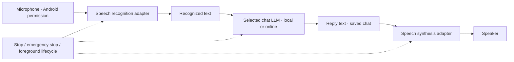

# Memory, personality, recovery and speech adapters
<!-- meshlit-document-tracking:start -->
Tracking reconciled 2026-10-10: [Plan](../PLAN.md) · [Progress](../PROGRESS.md) · [Document status](DOCUMENTATION_STATUS.md).
Scope: Android/shared reference; desktop ports have separate acceptance. Phase labels in older sections retain their original scope.
<!-- meshlit-document-tracking:end -->

Updated 2026-10-08. These are optional additions to the current chat controller.
They do not restore the historical Android Studio UI or response pipeline.

## Learn preferences over time

Open **Settings → Memory and personality**. All switches initially default off.
Enable memory, then add a short preference explicitly, or enable capture of
messages beginning **Remember that …**. Up to 128 facts of 512 characters each
are kept in encrypted app storage. Recall supplies at most three short matching
facts, within a 1,200-character context budget, to an on-device conversation.
The saved response-style profile can be enabled independently.

Turning memory off stops recall/capture and keeps the saved list for later use.
Forget removes a selected fact; Clear removes the entire list. This is preference
recall, not weight training, automatic fact verification or a record of every
conversation. A basic credential-keyword filter rejects obvious secrets; it is
not a complete sensitive-data classifier. Cloud/routed chats do not receive this
local memory context. No synchronization or remote memory export is implemented.

**Allow agents to manage these switches/facts** is a separate human delegation.
In the local chat options, also enable memory tools. The bounded `personal_memory`
tool can read switch/count status, add/delete facts and toggle memory, personality
or recovery while the saved delegation and global automation policy allow it.
It cannot export the saved facts, edit APK/source code or enlarge its own grants.
Turning off human delegation revokes these tool actions; turning off memory in
the human settings also removes that delegation.

**Recovery** permits one retry after a native local inference failure, by reloading
exactly the same installed model. It does not retry web/phone actions, switch
providers, download repairs or patch Android code. Physical recovery from every
native failure is not yet qualified. Source repair, model training and continual
quality improvements require reviewed updates and separate evaluations.

## Voice uses three independently chosen models



Open **Voice conversation** in the sidebar or the chat microphone button.
Choose recognition and voice output separately. A speech adapter does not replace
or retrain the chat LLM. Local chat can use offline recognition/output, or opt
into online speech while its text inference stays local. Conversely, an explicitly
selected online LLM can use offline speech input/output; recognized text then goes
to that LLM provider under the chat's existing online selection.

| Adapter | Input/output | Network and requirements |
| --- | --- | --- |
| Whisper ONNX pack | Speech → text | App-local installed English speech weights; no Android recognition service or network fallback |
| Piper ONNX pack | Text → PCM audio | App-local installed voice weights, tokens and phoneme data; separate from GGUF weights |
| Android recognizer | Speech → text | Guaranteed on-device API needs Android 12+ and an installed compatible service; earlier Android requires explicit service/network opt-in |
| Installed Android voice | Text → speech | Only voices marked offline are eligible with network audio off; actual installed voice data is required |
| OpenAI-format speech provider | Audio transcription and/or speech synthesis | Enabled HTTPS provider profile, supported STT/TTS model and voice IDs, existing credentials, explicit network-audio consent; no free quota is assumed |

The dialog defaults **Allow network audio** off. Recognition options never silently
fall back to a hosted service. For online transcription the selected provider
receives up to 30 seconds of microphone PCM encoded as WAV. Online synthesis sends
up to 4,000 reply characters. An Android service may process audio remotely only
when explicitly permitted. Meshlit keeps no microphone recording; temporary online
reply audio is deleted after use. Recognized user text and assistant replies remain
in the ordinary saved conversation.

Press **Preview voice** to hear actual output from the selected synthesis adapter.
Android pitch/rate presets provide natural, lower, higher, robotic and youthful styles;
they do not clone a person or prove a speaker's age/gender. An offline voice pack
has the speakers it was trained with; provider voice IDs and installed Android
voices supply other available voices. Piper/provider pitch controls are not
implemented and are not shown as working presets. Unsupported models/voices fail visibly.

Start requires Android microphone permission. Maximum session: ten turns or five
minutes, with a thirty-second microphone turn and a simple local energy/silence
endpoint detector. Listening pauses while the LLM thinks and the reply plays.
Stop, backgrounding, closing the dialog, a changed conversation, or emergency stop
ends capture/playback and cancels owned generation. Native SDK calls may finish
before cancellation can release the native model; controls stay locked during
cleanup. This is bounded turn-taking, not simultaneous full-duplex audio or
barge-in. Long spoken replies are bounded; the complete text remains in chat.

## Install offline speech packs

Speech weights are optional and are not bundled into the APK. For a reproducible
experimental pack, obtain these exact upstream release artifacts manually:

- [Whisper Tiny English ONNX archive](https://github.com/RunanywhereAI/sherpa-onnx/releases/download/runanywhere-models-v1/sherpa-onnx-whisper-tiny.en.tar.gz), SHA-256 `a903e9afa30142cab9327015a331f2fe13b15e0511f0bf1c4acfc21b51a7b8e7`.
- [Piper Lessac medium research archive](https://github.com/RunanywhereAI/sherpa-onnx/releases/download/runanywhere-models-v1/vits-piper-en_US-lessac-medium.tar.gz), SHA-256 `88572edcb92be5fc6ebbad0957c4effa5bdcfcf479407c24a3e918255b25625f`.

The [Whisper code/weight license](https://github.com/openai/whisper/blob/main/LICENSE)
is MIT. The Lessac voice archive carries a MODEL_CARD pointing to separate
[dataset terms](https://www.cstr.ed.ac.uk/projects/blizzard/2013/lessac_blizzard2013/license.html).
Its commercial redistribution rights have not been qualified; preserve that card
and use it as the owner's experimental research artifact. The Apache-2.0 app
license does not relicense speech weights or phoneme data. No speech binaries are
committed or published as part of these source changes. The existing RunAnywhere
SDK telemetry limitation remains: local speech weights do not establish an SDK
network opt-out. See the accepted Privacy Policy and production-release gates.

From the Meshlit source checkout:

```sh
python3 scripts/prepare-voice-packs.py --kind whisper \
  --archive /path/to/sherpa-onnx-whisper-tiny.en.tar.gz \
  --output /path/to/whisper-tiny-en.voice.zip
python3 scripts/prepare-voice-packs.py --kind piper \
  --archive /path/to/vits-piper-en_US-lessac-medium.tar.gz \
  --output /path/to/piper-lessac-medium.voice.zip
```

Transfer the ZIPs to the phone using USB, a granted file share or another device.
In the voice dialog, choose **Import offline voice pack** and select each file.
The app verifies the manifest, file allowlist, exact sizes and SHA-256 digests before
installing atomically. Imports reject unsafe paths, duplicates, unlisted files and
missing model components. Each pack is limited to 512 MiB and 512 files; eight
packs maximum. Import reserves 544 MiB free staging space. Select the recognition
and voice packs, then Preview/Start. Remove unneeded packs in the same dialog.
Installed files are verified again before loading.

The JSON manifest uses `meshlit-voice-pack/1`, a stable lowercase ID, name, language,
license/source, kind (`WHISPER_STT` or `PIPER_TTS`), and a list of relative file paths,
byte lengths and SHA-256 hashes. It must be the first ZIP entry. The preparation
script normalizes INT8 Whisper encoder/decoder filenames without changing bytes.
Pack metadata is a local declaration; successful import does not prove recognition
accuracy, synthesis quality or performance on a device.

## Official online audio and next adapters

The implemented provider path uses supported OpenAI-format `/audio/transcriptions`
and `/audio/speech` endpoints, with explicit IDs and the existing encrypted
profile/credential service. It is separate from hosted text inference. Local
contract tests do not establish a paid provider's model access, price or quota.

[OpenAI speech](https://developers.openai.com/api/docs/guides/text-to-speech),
[OpenAI Realtime](https://developers.openai.com/api/docs/guides/realtime-conversations)
and [Gemini Live](https://ai.google.dev/gemini-api/docs/live-api/capabilities)
have different protocols. Realtime/WebRTC/WebSocket session adapters, interruption
handling and Gemini native audio are next work, not a claim made by this HTTP
turn-taking adapter. Claude text can use the separate offline/online speech layer;
no native Claude speech API or voice entitlement is assumed.

Samsung Galaxy A20s/Android 11 app-UID qualification passed actual prerecorded
Whisper transcription and Piper synthesis, plus real local LLM generation while
both speech models were loaded. Speech cleanup preserved that LLM. The pinned
SDK's float PCM is explicitly normalized to bounded signed PCM16; invalid audio
is rejected. This does not establish microphone capture, playback quality or a
live provider conversation. [Exact device results](DEVICE_TESTING_2026-10-08.md).

Remaining qualification: real microphone end-to-end conversation and background/
Stop/revocation, multilingual packs, independent speaker inventory, audio latency
and sustained battery/thermal behavior, live provider accounts, full-duplex
interruptions, and an accessible larger-screen voice layout. See the
[device evidence ledger](DEVICE_TESTING_2026-10-08.md) for results actually run.
